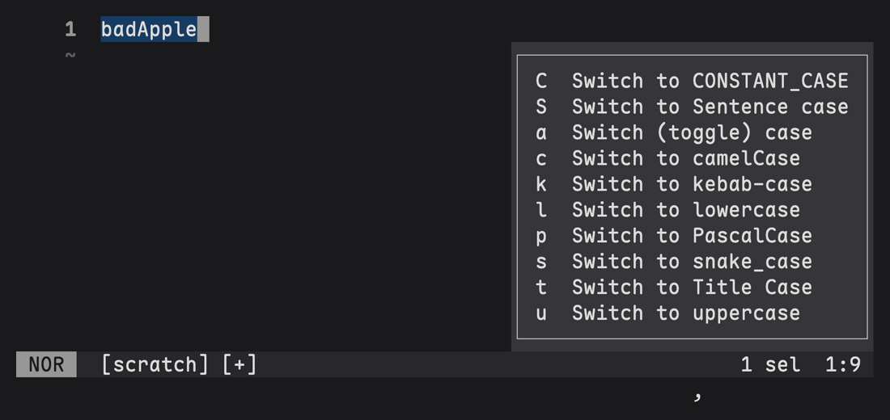

# case.hx

A [Helix](https://github.com/helix-editor/helix) plugin for changing keyword
case, written for the [Steel](https://github.com/mattwparas/steel) plugin
system.



## Install

Clone it anywhere and require it from `~/.config/helix/init.scm`:

```scheme
(require "/path/to/case.hx/case.scm")
(require (only-in "helix/keymaps.scm" add-global-keybinding))

;; ` enters case mode. l, u and a are helix builtins, the rest come from case.scm.
(define case-mode
  (hash "l" "switch_to_lowercase"
        "u" "switch_to_uppercase"
        "a" "switch_case"
        "c" ":switch-to-camel-case"
        "p" ":switch-to-pascal-case"
        "s" ":switch-to-snake-case"
        "k" ":switch-to-kebab-case"
        "C" ":switch-to-constant-case"
        "t" ":switch-to-title-case"
        "S" ":switch-to-sentence-case"))

(add-global-keybinding (hash "normal" (hash "`" case-mode)
                             "select" (hash "`" case-mode)))
```

Every command also works from the command line, for example
`:switch-to-snake-case`.

## Commands

| Key | Command | `hello_world` becomes |
| --- | --- | --- |
| `` `c `` | `switch-to-camel-case` | `helloWorld` |
| `` `p `` | `switch-to-pascal-case` | `HelloWorld` |
| `` `s `` | `switch-to-snake-case` | `hello_world` |
| `` `k `` | `switch-to-kebab-case` | `hello-world` |
| `` `C `` | `switch-to-constant-case` | `HELLO_WORLD` |
| `` `t `` | `switch-to-title-case` | `Hello World` |
| `` `S `` | `switch-to-sentence-case` | `Hello world` |
| `` `l `` | `switch_to_lowercase` (builtin) | `hello_world` |
| `` `u `` | `switch_to_uppercase` (builtin) | `HELLO_WORLD` |
| `` `a `` | `switch_case` (builtin) | `HELLO_WORLD` |

## Behaviour

Words are split on whitespace, `_` and `-`, and at camel boundaries, so
`fooBar` and `HTTPServer` split into `foo Bar` and `HTTP Server`. Everything
else, including `.`, `,` and digits, stays inside a word, so prose and paths
come through unharmed.

Conversion runs a line at a time and leaves each line's indentation and
trailing padding alone, so a multi-line selection keeps its shape.

All selections are converted at once, cursors end up on the rewritten text, and
the whole thing is a single undo step.

## Acknowledgements

Inspired by [helix#12043](https://github.com/helix-editor/helix/pull/12043) and
[coerce.nvim](https://github.com/gregorias/coerce.nvim).
